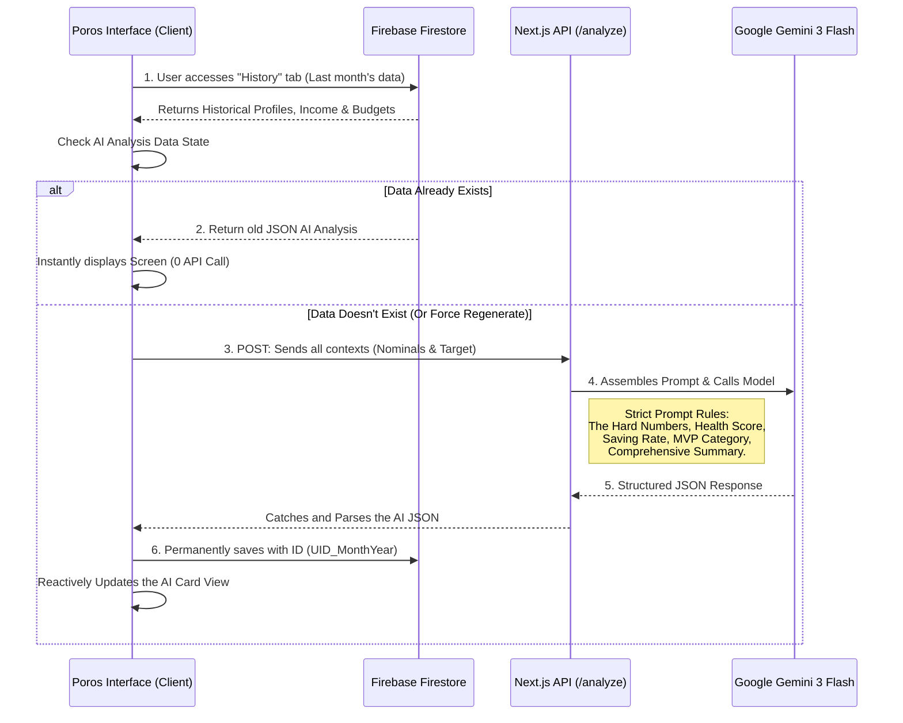

# Poros 💸

   

      
   

**Poros** is a _Personal Life OS_ and a web-based personal finance tracker assistant. Designed with a futuristic and minimalist aesthetic, it focuses on a _mobile-first_ experience that is fast, secure, and intuitive.

Built with a modern _tech stack_, this application doesn't just record numbers—it is equipped with an **AI Transaction Analysis** feature that provides sharp financial advice tailored to your profile (age, target goals, & profession) and tracks your historical trends.

## ✨ Core Features & Advantages

- **Personal AI Assistant (Poros AI):** Powered by the Google Gemini API, the AI reads your monthly spending patterns, provides a _Financial Score_, detects fund leaks (_Top Leaks_), and offers praise as well as _Actionable Advice_ custom-tailored to your age and occupation. Supports month-over-month _Trend Analysis_.
- **100% Free Server Efficiency (Lazy Evaluation):** AI queries are designed to run automatically only once when a new month is first opened, then locked in the local database. Supports manual _Regenerate_ feature.
- **Fast Authentication:** Login using your Google account (Google Sign-In) handled via Firebase Authentication. Safe and practical.
- **Lightning-Fast Recording:** A floating `+` button (Floating Action Button) that can be pressed anytime to record a new _expense_ instantly.
- **Five-Star Design:** The _dashboard_ uses the Poppins font, neat Shadcn icons, dynamic progress bars, and interactive cursors with an exclusive purple gradient theme (`#441752`).
- **Absolute Data Security:** Protected by multi-layered _Firestore Security Rules_ where data can only be accessed by the account owner.

## 🛠️ Tech Stack

- **Framework:** [Next.js](https://nextjs.org/) (App Router, Turbopack)
- **Styling:** [Tailwind CSS v4](https://tailwindcss.com/)
- **UI Components:** [Shadcn UI](https://ui.shadcn.com/)
- **Icons:** [Lucide React](https://lucide.dev/)
- **Backend & Database:** [Firebase SDK](https://firebase.google.com/) (Authentication & Firestore)
- **AI Integration:** [@google/genai](https://www.npmjs.com/package/@google/genai) (Google Gemini 3 Flash)
- **Typography:** [Google Fonts (Poppins)](https://fonts.google.com/specimen/Poppins)
- **Date Utility:** [date-fns](https://date-fns.org/)

## 🏗️ System Architecture (Poros AI)

Poros is designed with a **Client-Side Heavy & Serverless AI Integration** architecture to suppress server costs down to nearly 100% free.

### Workflow & Smart Execution (Lazy Evaluation)



### Execution Details:

1. **State Management & Data Layer:**
   - All daily transactions (`expenses`), monthly budget allocations (`budgets`), and profiles are stored specifically per user in **Firebase Firestore**. This data is read to the UI using a combination of _real-time listeners_ and _cached fetches_.

2. **AI Analysis Trigger (Lazy Evaluation):**
   - When a user opens the "History" tab for a certain month (e.g., February `2026-02`), the application checks the `ai_analysis` collection in Firestore.
   - If the analysis document **does not exist** (and the month is in the past), the UI shows an _Interactive Loading Status_ and silently calls our single Next.js API Endpoint (`/api/analyze`).
   - If it **already exists**, the application purely reads static JSON data from the database without calling Gemini at all.

3. **Context Gathering & Prompt Engineering:**
   - The application assembles a razor-sharp context: Total Income, Expenses, remaining Budget per drawer, _Age_, _Profession (Bio)_, _Target Goal (Life target)_, and even sucks in _Trend Data_ (income & expenses from 1 month prior).
   - All this data is compiled into a _Strict JSON_ format instruction via the Next.js _Route Handler_ backend, then fired into the **Google Gemini 3 Flash API**.

4. **Response Parsing & Deterministic Overwrite:**
   - Gemini responds in a structured JSON pattern containing: Nominal Remaining Money, _Health Score_, _Saving Rate_, a comprehensive long conclusion (_Poros' Summary_), Top Leaks, Achievements (_Praise_), and _Actionable_ Advice towards the _Target Goal_.
   - This JSON result is immediately caught by the Frontend and injected into the Firestore table via a _Deterministic ID_ (`UID_Year-Month`).
   - This _Deterministic ID_ concept allows users at any time to forcefully press the "Regenerate" button to overwrite the old AI review if they have just corrected their financial report.

## 🚀 Installation & Running Locally (Development)

To run this project locally on your computer, follow these steps:

### 1. Clone Repository & Install Dependencies

Make sure Node.js is installed. Open your _terminal_ and type:

```bash
git clone https://github.com/ichramsyah/tabung-menabung-webapp.git
cd tabung-menabung-webapp
npm install
```

### 2. Prepare Firebase (Required)

This application heavily relies on Firebase. You must create your own database service:

1. Open [Firebase Console](https://console.firebase.google.com/) and create a new project.
2. Enable the **Authentication** > **Google Sign-In** feature.
3. Enable the **Firestore Database** feature.
4. Under **Project Settings**, get your "Web App" API Keys config.

### 3. Configure Environment Variables

Create a file named `.env.local` next to _package.json_ (root), and insert your Firebase credentials along with your Gemini API Key:

```env
NEXT_PUBLIC_FIREBASE_API_KEY="AIzaSyA..."
NEXT_PUBLIC_FIREBASE_AUTH_DOMAIN="id-project.firebaseapp.com"
NEXT_PUBLIC_FIREBASE_PROJECT_ID="id-project"
NEXT_PUBLIC_FIREBASE_STORAGE_BUCKET="id-project.firebasestorage.app"
NEXT_PUBLIC_FIREBASE_MESSAGING_SENDER_ID="123456789"
NEXT_PUBLIC_FIREBASE_APP_ID="1:123456789:web:abcde"
GEMINI_API_KEY="AIzaSyA..."
```

### 4. Setup Firestore Security Rules

In the Firebase Console, open the Firestore menu -> **Rules** tab, then _copy-paste_ the rules below so your database is secure and operates normally:

```javascript
rules_version = '2';
service cloud.firestore {
  match /databases/{database}/documents {
    match /users/{userId} {
      allow read, write: if request.auth != null && request.auth.uid == userId;
    }
    match /budgets/{budgetId} {
      allow read, delete: if request.auth != null && request.auth.uid == resource.data.userId;
      allow create, update: if request.auth != null && request.auth.uid == request.resource.data.userId;
    }
    match /expenses/{expenseId} {
      allow read, delete: if request.auth != null && request.auth.uid == resource.data.userId;
      allow create, update: if request.auth != null && request.auth.uid == request.resource.data.userId;
    }
    match /income/{incomeId} {
      allow read, delete: if request.auth != null && request.auth.uid == resource.data.userId;
      allow create, update: if request.auth != null && request.auth.uid == request.resource.data.userId;
    }
    match /ai_analysis/{analysisId} {
      allow read, delete: if request.auth != null && request.auth.uid == resource.data.userId;
      allow create, update: if request.auth != null && request.auth.uid == request.resource.data.userId;
    }
  }
}
```

### 5. Running Server

Run the _development_ server:

```bash
npm run dev
```

Open [http://localhost:3000](http://localhost:3000) in your browser!

## 📦 Deployment Guide (Vercel)

This application is 100% _compatible_ to be directly _deployed_ for free to [Vercel](https://vercel.com).

1. _Push_ this code to your Github account.
2. Open Vercel and create a _New Project_ from that Github repository.
3. **IMPORTANT:** Add all the keys (`NEXT_PUBLIC_FIREBASE_...` and `GEMINI_API_KEY`) from the `.env.local` stage to the **Environment Variables** column in the Vercel _dashboard settings_ before clicking the _Deploy_ button.

---

_Created with the help of a collaborative AI system - 2026._
